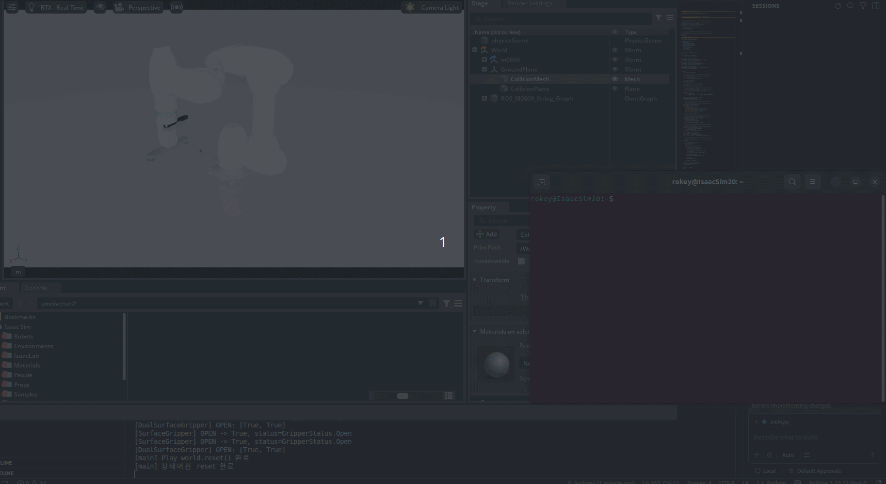

# M0609 Dual Suction Gripper Control with Isaac Sim and ROS 2

Doosan M0609 로봇과 듀얼 흡착 그리퍼를 Isaac Sim에서 제어하고, 외부 ROS 2 노드에서 목표 좌표를 전달할 수 있도록 구성한 프로젝트입니다.

ROS 2에서는 `std_msgs/msg/String` 형식의 JSON 메시지를 사용하며, Isaac Sim 내부의 ROS 2 Bridge가 명령을 수신한 뒤 상태 머신의 `request_move(x, y, z)`를 호출합니다.

---

## Demo

<p align="center">
  
</p>

<p align="center">
  <b>ROS 2 명령을 이용한 Doosan M0609 End-Effector 제어</b>
</p>

외부 ROS 2 노드에서 목표 좌표를 전송하면 Isaac Sim 내부의 ROS 2 Bridge가 명령을 수신하고, 상태 머신을 통해 Doosan M0609 로봇을 제어합니다.

시연에서는 다음 동작을 확인할 수 있습니다.

- `/m0609/move_command` 토픽을 통한 목표 좌표 전달
- `IDLE` 상태에서 이동 명령 수락
- RMPflow 기반 End-Effector 이동
- 이동 중 추가 명령에 대한 `Robot is busy` 응답
- 목표 도달 후 `MOVE`에서 `IDLE` 상태로 자동 복귀
- `/m0609/move_result` 토픽을 통한 명령 수락 결과 확인

### Full Demo Video

[전체 시연 영상 보기](https://youtu.be/lUkjD_ka7SA?si=MjtNpOerHc2g-EjU)

---

## 1. 주요 기능

- Isaac Sim 기반 Doosan M0609 시뮬레이션
- RMPflow 기반 End-Effector 위치 제어
- 듀얼 Surface Gripper 구성
- ROS 2 외부 좌표 명령 수신
- 상태 머신 기반 명령 수락 및 이동 제어
- 이동 중 추가 명령 거부
- 명령 수락 결과 ROS 2 토픽 발행
- 목표 도달 시 자동으로 `IDLE` 상태 복귀

---

## 2. 개발 환경

현재 프로젝트에서 사용한 기준 환경입니다.

- Ubuntu
- Isaac Sim 5.1
- Python 3.11 (Isaac Sim 내장 Python)
- ROS 2 Humble
- Fast DDS
- Doosan M0609
- Isaac Sim RMPflow
- Isaac Sim ROS 2 Bridge

ROS 2 통신 환경:

```bash
export ROS_DOMAIN_ID=140
export ROS_DISTRO=humble
export RMW_IMPLEMENTATION=rmw_fastrtps_cpp
```

Isaac Sim ROS 2 Bridge 라이브러리 경로:

```bash
export LD_LIBRARY_PATH=$LD_LIBRARY_PATH:$HOME/dev_ws/isaac_sim/isaacsim/_build/linux-x86_64/release/exts/isaacsim.ros2.bridge/humble/lib
```

> Isaac Sim 설치 위치가 다르면 위 경로를 실제 설치 경로에 맞게 수정해야 합니다.

---

## 3. 프로젝트 구조

전체 프로젝트에는 USD 수집 파일과 재질, 센서, 로봇 모델이 포함되어 있습니다. 핵심 실행 파일은 다음과 같습니다.

```text
gripper_technique_test/
├── main.py
├── m0609_config.py
├── m0609_task.py
├── m0609_state_machine.py
├── m0609_move_controller.py
├── m0609_ros_bridge.py
├── dual_surface_gripper_adapter.py
├── surface_gripper_adapter.py
├── rmpflow/
│   ├── m0609_description.yaml
│   ├── m0609_rmpflow_common.yaml
│   ├── m0609_rmpflow_controller.py
│   ├── m0609_pick_place_controller.py
│   └── m0609_pick_place_controller_surface.py
├── doosan-robot2/
│   ├── urdf/
│   └── usd/
├── Collected_model_redtray_scaled_for_180mm_pads/
├── Collected_test_dual_suction_surface_grippers_fixed_paths/
└── README.md
```

### 핵심 파일 설명

#### `main.py`

전체 프로그램의 시작점입니다.

- Isaac Sim 실행
- World 및 Task 생성
- M0609 상태 머신 생성
- ROS 2 Bridge 생성
- 시뮬레이션 루프 실행
- 매 프레임 `state_machine.step()` 호출

#### `m0609_state_machine.py`

로봇의 현재 제어 상태를 관리합니다.

상태:

```text
IDLE
  └─ request_move() 수락
        ↓
      MOVE
        ├─ 추가 요청 수신 → 거부
        └─ 목표 도달
              ↓
            IDLE
```

주요 메서드:

```python
request_move(x, y, z)
step()
cancel()
reset()
consume_status_message()
```

#### `m0609_ros_bridge.py`

ROS 2와 상태 머신을 연결합니다.

- `/m0609/move_command` 구독
- JSON 메시지 파싱
- `state_machine.request_move(x, y, z)` 호출
- 요청 수락 여부를 `/m0609/move_result`로 발행

#### `m0609_rmpflow_controller.py`

RMPflow를 이용해 End-Effector 목표 위치까지 이동하도록 관절 명령을 생성합니다.

#### `dual_surface_gripper_adapter.py`

듀얼 흡착 그리퍼를 하나의 그리퍼처럼 제어하기 위한 어댑터입니다.

---

## 4. 전체 동작 구조

```text
외부 ROS 2 노드
        │
        │ /m0609/move_command
        │ std_msgs/msg/String
        ▼
Isaac Sim ROS 2 Bridge
        │
        │ JSON 파싱
        ▼
M0609StateMachine.request_move(x, y, z)
        │
        ├─ IDLE 상태
        │    └─ 목표 등록 후 MOVE 상태 전환
        │
        └─ MOVE 상태
             └─ "Robot is busy" 반환

M0609StateMachine.step()
        │
        ▼
RMPFlowController.forward()
        │
        ▼
robot.apply_action()
        │
        ▼
목표 위치 도달
        │
        ▼
IDLE 상태 복귀
```

ROS Bridge는 항상 토픽을 구독하지만, 명령 수락 여부는 상태 머신이 결정합니다.

따라서 이동 중 새로운 명령이 들어오더라도 기존 목표 좌표는 변경되지 않습니다.

---

## 5. 상태 머신 동작

### `IDLE`

새로운 이동 명령을 받을 수 있는 상태입니다.

```python
accepted, message = state_machine.request_move(x, y, z)
```

정상적인 좌표가 들어오면:

```text
IDLE → MOVE
```

로 전환됩니다.

### `MOVE`

RMPflow를 통해 매 시뮬레이션 프레임마다 이동 명령을 계산합니다.

```python
actions = self._move_controller.forward(
    target_end_effector_position=self._target_position,
    target_end_effector_orientation=self._target_orientation,
)

self._robot.apply_action(actions)
```

이동 중 새로운 명령이 들어오면:

```json
{
  "accepted": false,
  "message": "Robot is busy"
}
```

를 반환합니다.

### 목표 도달

현재 End-Effector 위치와 목표 위치 사이의 거리가 설정된 tolerance 이하가 되면 이동을 완료합니다.

```python
remaining_distance <= position_tolerance
```

이후 목표를 초기화하고 다시 `IDLE` 상태로 돌아갑니다.

---

## 6. ROS 2 토픽

### 이동 명령 토픽

```text
/m0609/move_command
```

메시지 타입:

```text
std_msgs/msg/String
```

문자열 내부에는 JSON 객체를 전달합니다.

예시:

```json
{
  "request_id": "move_001",
  "x": 0.45,
  "y": 0.15,
  "z": 0.45
}
```

필드 설명:

| 필드         |   타입 | 설명                     |
| ------------ | -----: | ------------------------ |
| `request_id` | string | 요청 구분용 ID           |
| `x`          |  float | World 좌표계 기준 X 위치 |
| `y`          |  float | World 좌표계 기준 Y 위치 |
| `z`          |  float | World 좌표계 기준 Z 위치 |

### 명령 결과 토픽

```text
/m0609/move_result
```

메시지 타입:

```text
std_msgs/msg/String
```

응답 예시:

```json
{
  "request_id": "move_001",
  "accepted": true,
  "message": "Move command accepted"
}
```

이 응답은 목표 도달 완료가 아니라, 상태 머신이 명령을 수락했는지를 의미합니다.

이동 중 추가 요청이 들어오면:

```json
{
  "request_id": "move_002",
  "accepted": false,
  "message": "Robot is busy"
}
```

가 발행됩니다.

---

## 7. 실행 방법

### 7.1 ROS 2 환경 설정

외부 ROS 2 터미널과 Isaac Sim 실행 터미널 모두 동일한 Domain ID를 사용해야 합니다.

```bash
export ROS_DOMAIN_ID=140
export ROS_DISTRO=humble
export RMW_IMPLEMENTATION=rmw_fastrtps_cpp
```

Isaac Sim 실행 터미널에서는 ROS 2 Bridge 라이브러리 경로도 추가합니다.

```bash
export LD_LIBRARY_PATH=$LD_LIBRARY_PATH:$HOME/dev_ws/isaac_sim/isaacsim/_build/linux-x86_64/release/exts/isaacsim.ros2.bridge/humble/lib
```

환경 변수를 매번 입력하기 싫다면 `~/.bashrc`에 추가할 수 있습니다.

```bash
echo 'export ROS_DOMAIN_ID=140' >> ~/.bashrc
echo 'export ROS_DISTRO=humble' >> ~/.bashrc
echo 'export RMW_IMPLEMENTATION=rmw_fastrtps_cpp' >> ~/.bashrc
echo 'export LD_LIBRARY_PATH=$LD_LIBRARY_PATH:$HOME/dev_ws/isaac_sim/isaacsim/_build/linux-x86_64/release/exts/isaacsim.ros2.bridge/humble/lib' >> ~/.bashrc

source ~/.bashrc
```

---

### 7.2 프로젝트 실행

프로젝트 디렉터리로 이동합니다.

```bash
cd ~/dev_ws/gripper_technique_test
```

Isaac Sim의 Python 실행 파일로 `main.py`를 실행합니다.

```bash
~/dev_ws/isaac_sim/isaacsim/_build/linux-x86_64/release/python.sh main.py
```

Isaac Sim 설치 경로가 다르면 실제 `python.sh` 경로에 맞게 수정합니다.

실행 후 다음과 같은 로그가 나오면 ROS Bridge가 준비된 상태입니다.

```text
[ROS2 Bridge] ready: /m0609/move_command -> state_machine.request_move() -> /m0609/move_result
```

---

## 8. 외부에서 좌표 명령 보내기

새 터미널을 열고 ROS 2 환경을 설정합니다.

```bash
source /opt/ros/humble/setup.bash

export ROS_DOMAIN_ID=140
export ROS_DISTRO=humble
export RMW_IMPLEMENTATION=rmw_fastrtps_cpp
```

이동 명령 전송:

```bash
ros2 topic pub --once /m0609/move_command std_msgs/msg/String \
"{data: '{\"request_id\":\"move_001\",\"x\":0.45,\"y\":0.15,\"z\":0.45}'}"
```

다른 좌표 예시:

```bash
ros2 topic pub --once /m0609/move_command std_msgs/msg/String \
"{data: '{\"request_id\":\"move_002\",\"x\":0.40,\"y\":-0.15,\"z\":0.50}'}"
```

### 반복 발행

테스트 목적으로 초당 1회 반복 발행할 수 있습니다.

```bash
ros2 topic pub -r 1 /m0609/move_command std_msgs/msg/String \
"{data: '{\"request_id\":\"repeat_test\",\"x\":0.45,\"y\":0.15,\"z\":0.45}'}"
```

이동 중에는 상태 머신이 `Robot is busy`를 반환합니다.

반복 발행을 중지하려면:

```text
Ctrl + C
```

---

## 9. 명령 결과 확인

다른 터미널에서 결과 토픽을 확인합니다.

```bash
source /opt/ros/humble/setup.bash

export ROS_DOMAIN_ID=140
export RMW_IMPLEMENTATION=rmw_fastrtps_cpp

ros2 topic echo /m0609/move_result
```

정상 수락 예시:

```yaml
data: '{"request_id": "move_001", "accepted": true, "message": "Move command accepted"}'
```

이동 중 요청 예시:

```yaml
data: '{"request_id": "move_002", "accepted": false, "message": "Robot is busy"}'
```

---

## 10. ROS 연결 확인

### 토픽 목록 확인

```bash
ros2 topic list
```

다음 토픽이 보여야 합니다.

```text
/m0609/move_command
/m0609/move_result
```

### Subscriber 확인

```bash
ros2 topic info /m0609/move_command -v
```

정상적으로 연결되면 다음과 같은 구독 노드가 표시됩니다.

```text
Node name: _World_ROS_M0609_String_Graph_CommandSubscriber
Endpoint type: SUBSCRIPTION
```

### 메시지 타입 확인

```bash
ros2 topic type /m0609/move_command
```

출력:

```text
std_msgs/msg/String
```

### Domain ID 확인

```bash
echo $ROS_DOMAIN_ID
```

출력:

```text
140
```

외부 ROS 2 터미널과 Isaac Sim 실행 터미널의 Domain ID가 반드시 같아야 합니다.

---

## 11. 입력 좌표 범위

입력 좌표는 Isaac Sim World 좌표계 기준이며 단위는 meter입니다.

M0609의 최대 도달 거리만으로 명령 가능 여부를 판단할 수는 없습니다. 실제 도달 가능 여부는 다음 요소에 영향을 받습니다.

- 로봇 Base의 World 위치
- End-Effector 및 흡착 그리퍼 길이
- 관절 제한
- 목표 방향 유지 조건
- 바닥 및 주변 물체 충돌
- 특이점
- RMPflow 설정
- 흡착 패드 및 트레이 위치

### 권장 초기 테스트 범위

현재 테스트에 사용한 좌표를 기준으로, 처음에는 다음 범위에서 확인하는 것을 권장합니다.

```text
X:  0.30 ~ 0.65 m
Y: -0.35 ~ 0.35 m
Z:  0.20 ~ 0.70 m
```

안전한 첫 테스트 좌표:

```text
x = 0.45
y = 0.15
z = 0.45
```

명령:

```bash
ros2 topic pub --once /m0609/move_command std_msgs/msg/String \
"{data: '{\"request_id\":\"safe_test\",\"x\":0.45,\"y\":0.15,\"z\":0.45}'}"
```

### 대략적인 작업 반경

M0609은 약 0.9 m급 작업 반경을 갖는 로봇이지만, 이 프로젝트에서는 그리퍼 길이와 현재 방향 유지 조건 때문에 실제 사용 가능한 범위가 더 작습니다.

대략적으로 다음 조건 안에서 접근하는 것이 좋습니다.

```text
sqrt(x² + y²) < 약 0.75 ~ 0.85 m
```

단, 이는 로봇 Base가 World 원점 근처에 있다는 가정의 참고값입니다.

### 주의할 좌표

다음 위치는 피하는 것이 좋습니다.

- 로봇 Base와 지나치게 가까운 위치
- 바닥 아래의 `z < 0`
- 최대 작업 반경 근처
- 로봇 뒤쪽의 큰 음수 X 영역
- 관절이 완전히 펴지는 위치
- 트레이나 테이블과 충돌할 수 있는 낮은 Z 위치

현재 코드는 좌표의 유한성만 검사합니다.

```python
np.all(np.isfinite(position))
```

따라서 작업 반경 밖의 좌표도 형식상 수락될 수 있습니다. 실제 운영에서는 `request_move()`에 좌표 제한 검사를 추가하는 것이 좋습니다.

예시:

```python
if not 0.30 <= x <= 0.65:
    return False, "X coordinate is out of range"

if not -0.35 <= y <= 0.35:
    return False, "Y coordinate is out of range"

if not 0.20 <= z <= 0.70:
    return False, "Z coordinate is out of range"
```

이 범위는 현재 시뮬레이션 배치에 맞게 조정해야 합니다.

---

## 12. JSON 입력 형식 오류

정상 형식:

```json
{
  "request_id": "move_001",
  "x": 0.45,
  "y": 0.15,
  "z": 0.45
}
```

잘못된 예시:

```json
{
  "request_id": "move_001",
  "x": "abc",
  "y": 0.15
}
```

`z`가 없거나 숫자로 변환할 수 없는 값이 들어오면 다음과 같이 거부됩니다.

```json
{
  "request_id": "move_001",
  "accepted": false,
  "message": "Invalid command: ..."
}
```

`NaN`, `Infinity` 등의 값은 상태 머신에서 거부합니다.

---

## 13. 주요 로그

ROS Bridge 준비 완료:

```text
[ROS2 Bridge] ready: /m0609/move_command -> state_machine.request_move() -> /m0609/move_result
```

명령 수락:

```text
[ROS2 Bridge] move request: request_id=move_001, target=(0.4500, 0.1500, 0.4500), accepted=True, message=Move command accepted
```

이동 중 추가 요청:

```text
[ROS2 Bridge] move request: request_id=move_002, target=(0.4000, -0.1500, 0.5000), accepted=False, message=Robot is busy
```

명령 형식 오류:

```text
[ROS2 Bridge] command error: ...
```

---

## 14. 문제 해결

### `Subscription count: 0`

Isaac Sim의 Subscriber가 생성되지 않았거나 Domain ID가 다를 수 있습니다.

확인:

```bash
echo $ROS_DOMAIN_ID
ros2 topic info /m0609/move_command -v
```

Isaac Sim과 외부 ROS 2 터미널 모두:

```text
ROS_DOMAIN_ID=140
```

이어야 합니다.

### 메시지를 보냈지만 Isaac Sim에서 수신되지 않음

확인 항목:

1. Isaac Sim이 Play 상태인지 확인
2. ROS 2 Bridge 준비 로그 확인
3. `ROS_DOMAIN_ID` 확인
4. `RMW_IMPLEMENTATION` 확인
5. 토픽 이름 확인
6. 메시지 타입 확인

```bash
ros2 topic type /m0609/move_command
```

정상 출력:

```text
std_msgs/msg/String
```

### `Robot is busy`

현재 상태 머신이 `MOVE` 상태입니다.

로봇이 목표에 도달하여 `IDLE`로 돌아간 뒤 다시 명령을 보내야 합니다.

### 명령은 수락됐지만 로봇이 움직이지 않음

메인 루프에서 다음 코드가 매 프레임 실행되는지 확인합니다.

```python
state_machine.step()
```

`request_move()`는 목표를 등록할 뿐이며, 실제 이동은 `step()`에서 수행됩니다.

### 로봇이 목표에 도달하지 못함

가능한 원인:

- 작업 반경 밖의 좌표
- 관절 제한
- 특이점
- 충돌
- 목표 방향 유지가 불가능한 위치
- RMPflow 설정 문제
- Position tolerance가 지나치게 작음

---

## 15. 현재 구현 범위

현재 구현된 ROS 2 기능:

- 이동 명령 수신
- 명령 수락 또는 거부
- 결과 토픽 발행

현재 `/m0609/move_result`는 명령 접수 결과입니다.

아직 별도 구현이 필요한 기능:

- 실제 목표 도착 결과 발행
- 이동 진행률 발행
- 남은 거리 발행
- 이동 취소 토픽
- 비상 정지
- 작업 반경 자동 검사
- 충돌 전 사전 검증
- 다중 명령 Queue
- 흡착 그리퍼 동작 명령
- Pick and Place 전체 시퀀스 명령

---

## 16. 향후 개선 방향

- `/m0609/move_status` 토픽 추가
- `MOVING`, `ARRIVED`, `IDLE` 상태 발행
- 목표 도달 여부와 명령 접수 응답 분리
- 좌표 제한 검사 추가
- 이동 취소 명령 추가
- 명령 Queue 추가
- 흡착 ON/OFF ROS 명령 추가
- 트레이 Pick and Place 자동화
- ROS 2 Action 기반 장기 동작 요청 구조로 확장

---

## 17. 빠른 실행 요약

### Isaac Sim 실행 터미널

```bash
export ROS_DOMAIN_ID=140
export ROS_DISTRO=humble
export RMW_IMPLEMENTATION=rmw_fastrtps_cpp
export LD_LIBRARY_PATH=$LD_LIBRARY_PATH:$HOME/dev_ws/isaac_sim/isaacsim/_build/linux-x86_64/release/exts/isaacsim.ros2.bridge/humble/lib

cd ~/dev_ws/gripper_technique_test

~/dev_ws/isaac_sim/isaacsim/_build/linux-x86_64/release/python.sh main.py
```

### 외부 ROS 2 터미널

```bash
source /opt/ros/humble/setup.bash

export ROS_DOMAIN_ID=140
export RMW_IMPLEMENTATION=rmw_fastrtps_cpp

ros2 topic echo /m0609/move_result
```

### 좌표 명령 전송

```bash
ros2 topic pub --once /m0609/move_command std_msgs/msg/String \
"{data: '{\"request_id\":\"move_001\",\"x\":0.45,\"y\":0.15,\"z\":0.45}'}"
```
